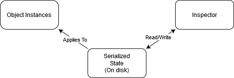

# Fundamentals

## Serialization
At the center of the editor sits seralization, without serialization the whole editor would fall flat. This is especially true for anything related to editor integration, thus very important for the aspiring editor programmer.

Serialization links everything together, every value in the inspector, in your scene, or in the settings is serialized. This is done to prevent all values from resetting every time you close Unity, enter/exit playmode, or change your code. These events are what we call assembly reloads. During these assembly reloads Unity will unload all C# code (including large parts of the editor itself) and recompile and load the assemblies. After an assembly reload is completed Unity will restore all serialized data to their respective objects. Therefore if your data is not serialized during an assembly reload then it will all be lost.

The serialized state is initialized by the default values in your code, this is why when you later change the default value it is not updated in the inspector (you can manually update it by right clicking on the component and pressing reset). 

To view this serialized state you can set your editor to use text serialization and open any `*.meta` or `*.asset` file to see what is being saved.

The recommended way to interact with the serialized state is by using something called SerializedObjects and SerializedProperties, in the next chapter we will discuss those further.

## Serialized fields

By default all public fields are serialized if the type of the field supports serialization. Private fields however are not serialized unless you apply a `SerializeField` attribute to those fields. 

All serialized fields are serialized by value, this means that it is not possible to have multiple fields refer to the same value. The exception to this is types that derive from `UnityEngine.Object` or fields that have the `SerializedReference` attribute.

All basic types support serialized however custom structs and classes are required to have the `Serializable` attribute applied to the class or struct. This of course also requires fields in that class or struct to be public or have the `SerializeField` attribute applied to those fields.

There are more attributes that influence serialization, e.g. `NonSerialized` which makes any serialized field not serialized. This is useful for when you want public fields that should not be serialized. `HideInInspector` does not influence serialization but is useful to hide a serialized field.

### SerializeReference

`SerializeReference` is a new attribute (introduced in 2019.3) that lets you serialize non Unity objects by reference. This only works for the same `UnityEngine.Object`, e.g. 2 `MonoBehavior`s can't share references. Even with this big limitations it is still very useful for graph or tree like structures. `SerializeReference` is definitely worth looking into if you are planning on using these data structures.

## Interacting with the serialized state

### SerializedObjects and SerializedProperties

As mentioned before the recommended way to interact with the serialized state is uinsg SerializedObjects and SerializedProperties. These classes offer a relative simple API to read and write to the serialized state. `SerializedObject`s offer a few advantages to other methods (e.g. direct object manipulation or reflection). `SerializedObject`s automatically get undo and multi object editing support. This needs to be manually done for the other options.

Custom editors and `PropertyDrawer`'s expose either a `SerializedObject` or a `SerializedProperty`. If neither of those are available you can use the constructor of `SerializedObject` to create one. 

Once you have either of those you can use `FindProperty` or `FindPropertyRelative` to find a `SerializedProperty`, using this `SerializedProperty` you can read or write values using one of the many fields. E.g. `intValue` for all int based types (int, long, uint etc...), `boolValue` for all `bool`s.

Just writing to a `SerializedProperty` is not enough as that only update the in memory representation. To apply these changes to the serialized state you must call either `ApplyModifiedProperties` or `ApplyModifiedPropertiesWithoutUndo`. 

If you've update the serialized state through some other means you can use the Update method on `SerializedObject` to update the values in your `SerializedObject`. It is recommended to do this at the beginning of your OnGUI method.

### Direct Object Modification

There are few reasons to directly modify the object without going through `SerializedObject` however you might still find one. As previously mentioned you will have to manually support undo and multi object editing if those are wanted.

If you've ran into one of these cases you can use `Undo.RecordObject` before modifying the object, this will apply the changes to the serialized state. If Undo is unwanted you can use `EditorUtility.SetDirty` or `EditorSceneManager.MarkSceneDirty` for changes in the scene. However these do not offer undo support.

## Extending serialization