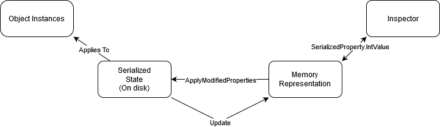
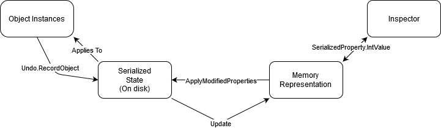

# Fundamentals

## Serialization
As a large part of editor scripting revolves around saving and loading data, even if you might not realize it at first. Therefore it is very important to understand how Unity handles saving and loading or also known as serialization.~~~~

Serialization is the process of converting an instance of a class to a format (usually text based) that is more friendly to being saved, Unity uses either YAML or a Binary format. It is recommended to use YAML serialization as this is human readable and is better for source control. As you might expect there is also the process of turning a text based format back into a class, this is called deserialization.

Serialization links everything together, every value in the inspector, in your scene, or in the settings is serialized to your disk. This is done to prevent all values from resetting during the following events:
* Opening/closing Unity
* Entering/exiting play-mode
* Importing any code

These events are what we call assembly reloads. During these assembly reloads Unity will unload all C# code (including large parts of the editor itself) and recompile and load the assemblies. After an assembly reload is completed Unity will restore (also known as deserialization) all serialized data from disk to their respective objects. Therefore if your data is not serialized during an assembly reload; it will all be lost.

The serialized state is initialized and saved by the default values in your code, Unity from then on applies the serialized state on top of your default values. The recommended way to interact with the serialized state is by using `SerializedObject`s and SerializedProperties, in the next chapters we will discuss those further.

To view this serialized state you can set the Unity editor to use text serialization and open any `*.meta` or `*.asset` file to see what is currently saved.

## Serialized fields

By default all public fields are serialized if the type of the field supports serialization. Private fields however are not serialized unless you apply an `SerializeField` attribute to those fields. 

In general all objects **not** deriving from `UnityEngine.Object` are serialized by value, this means that it is not possible to have multiple fields refer to the same object or value. Types derived from `UnityEngine.Object` are serialized by reference, fields with the `SerializeReference` attribute are also serialized by reference under certain conditions.

All basic types support serialized however custom structs and classes are required to have the `Serializable` attribute applied to the class or struct. This of course also requires fields in that class or struct to be public or have the `SerializeField` attribute applied to those fields.

There are also other attributes that influence serialization, e.g. `NonSerialized` which makes any serialized field not serialized. This is useful for when you want public fields that should not be serialized but they should be accessible outside of the class. `HideInInspector` does not influence serialization but it is useful to hide a serialized field.

### SerializeReference

`SerializeReference` is a new attribute (introduced in 2019.1) that lets you serialize non Unity objects by reference and it also allows you to serialize polymorphic types, i.e. types derived from a single base class. This only works for the in one `UnityEngine.Object`, i.e. 2 `MonoBehavior`s can't share references. Even with this big limitation it is still very useful for graph or tree like structures. `SerializeReference` is definitely worth looking into if you are planning on using data structures similar to graphs or trees.

## Interacting with the serialized state

### SerializedObjects and SerializedProperties

As mentioned before the recommended way to interact with the serialized state is uinsg SerializedObjects and SerializedProperties. These classes offer a relative simple API to read and write to the serialized state. `SerializedObject`s offer a few advantages to other methods (e.g. direct object manipulation or reflection). `SerializedObject`s automatically get undo and multi object editing support. This needs to be manually programmed for the other options.

Custom editors and `PropertyDrawer`'s expose either a `SerializedObject` or a `SerializedProperty`. If neither of those are available you can use the constructor of `SerializedObject` to create one. 

Once you have either of those you can use `FindProperty` or `FindPropertyRelative` to find a `SerializedProperty`, using this `SerializedProperty` you can read or write values using one of the many fields. E.g. `intValue` for all int based types (int, long, uint etc...), `boolValue` for all `bool`s.

Just writing to a `SerializedProperty` is not enough as that only update the in memory representation. To apply these changes to the serialized state you must call either `ApplyModifiedProperties` or `ApplyModifiedPropertiesWithoutUndo`. 

If you've updated the serialized state through some other means you can use the `Update` method on `SerializedObject` to update the values in your `SerializedObject`. It is recommended to always do this at the beginning of your OnGUI method.

### Direct Object Modification

There are few reasons to directly modify the object without going through `SerializedObject` however you might still find one. As previously mentioned you will have to manually support undo and multi object editing if those are wanted.

If you've ran into one of these cases you can use `Undo.RecordObject` before modifying the object, this will apply the changes to the serialized state. If Undo is unwanted you can use `EditorUtility.SetDirty` or `EditorSceneManager.MarkSceneDirty` for changes in the scene. However these do not offer undo support.

## Extending serialization

It is possible to extend serialization to support types that are ordinarily not supported. This can be done using the `ISerializationCallbackReceiver` interface. Implementing this interface gives you 2 methods `OnBeforeSerialize` and `OnAfterDeserialize`. As the names suggest they are called before Unity serializes your class and after Unity deserializes your class. In these callbacks you have to implement your custom serialization, there are 2 common approaches to this. 

Approach #1: This approach requires you to manually create fields that will need to be filled in in `OnBeforeSerialize` to save the data that you need. For example to serialize a dictionary you can create 2 lists, one for the key and one for the value. This approach is useful if you only want to serialize a small amount of custom type and don't mind wrapping it in it's own class.

Approach #2: This approach is a lot more extendable and is useful for when you want to serialize multiple different types. This approach requires a separate serializer from Unity, either a third party serializer or a custom one. You can then use this serializer in `OnBeforeSerialize` and in `OnAfterDeserialize` to serialize your whole class (or specific types/fields) and save that data in a serialized field, e.g. as a JSON string. This is really powerful as it very easily gives support to new types. However it can be quite a lot of extra work in your custom editors to support this approach.

Note that serialization and deserialization happens on a different thread, to deserialize a class or a struct Unity has to invoke the constructor. This often causes the constructor to be called at unexpected moments and might throw exceptions as Unity APIs are generally not supported on different threads. This is why it's best practice to minimize the use of constructors; if you must then don't use Unity methods.